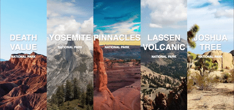

# National parks in California




## Simple template of big banner

Your can change images in css file `styles/style.css`


```css

.section:nth-child(1) {
    background-image: url("../images/pexels-photo-226365.jpeg");
}
.section:nth-child(2) {
    background-image: url("../images/pexels-photo-28162.jpg");
}
.section:nth-child(3) {
    background-image: url("../images/pexels-photo-28051.jpg");
}
.section:nth-child(4) {
    background-image: url("../images/lassen-volcanic-1088492_1920.jpg");
}
.section:nth-child(5) {
    background-image: url("../images/joshua-tree-national-park-74399_1920.jpg");
}

```

also you can change names in html `index.html`

```html

<div class="cont_title">
    <h1>Death Value</h1>
    <h3>National Park</h3>
</div>
<div class="cont_desc">
    <p>California</p>
</div>

```
